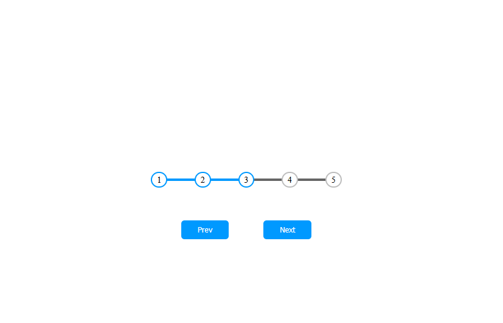

# 📸 Progress Panel Website – Day 2 Project

Welcome to my project in my daily coding journey!  
This panel was built to help me practice DOM manipulation and flexbox layout. It's a small but interactive project that tracks your progress through four steps using a dynamic progress bar and animated buttons.  

---

##  What It Does:

- Displays four step indicators (circles) connected by a progress line  
- Highlights completed steps with color and styling  
- Enables and disables "Prev" and "Next" buttons at the correct times  
- Visually updates progress with each button click  

---

## 🔍 Preview

---

## 📚 What I Learned:

- How to use `querySelectorAll()` and treat the result like an array  
- Dynamically updating element styles with `style.width` in JavaScript  
- The importance of `transform: translateY()` vs. `transition` for positioning  
- How overlapping class names can create conflicting styles  
- Positioning elements absolutely to align lines through circle centers  

---

## What Went Wrong:

- I accidentally reused the class name `.Progress` for both the container and the progress bar  
- The blue progress bar appeared in the wrong place due to incorrect use of `transform` and `top`  
- Forgot to call the `update()` function after button clicks at first  
- Minor issues like a missing dash in a class name and misused semicolons  

### ✅ The Fix:

- Renamed the container class to `.progress-container` to avoid style conflicts  
- Switched from `top: 50%` and `transform` to `top: 15px` for proper alignment  
- Ensured `update()` runs every time a button is clicked  
- Cleaned up syntax and corrected minor typos  

---

## 🚀 Future Ideas

- Add labels (e.g. “Step 1”, “Step 2”) under each circle  
- Animate the progress bar fill more smoothly  
- Link content or forms to each step  
- Add hover effects or transitions for a cleaner UI  

---

## 💬 General Comments / Questions

So far this is my second daily project to explore ideas I’ve been wanting to try dynamically.  

Some of the small issues I ran into were things like forgetting a dash on a container or misplacing some semicolons.  

One of the most helpful things I learned was how `querySelectorAll()` returns a NodeList you can loop through, which made updating classes easy.  

Nothing too insane—just a fun little project I’d been wanting to finally make.
